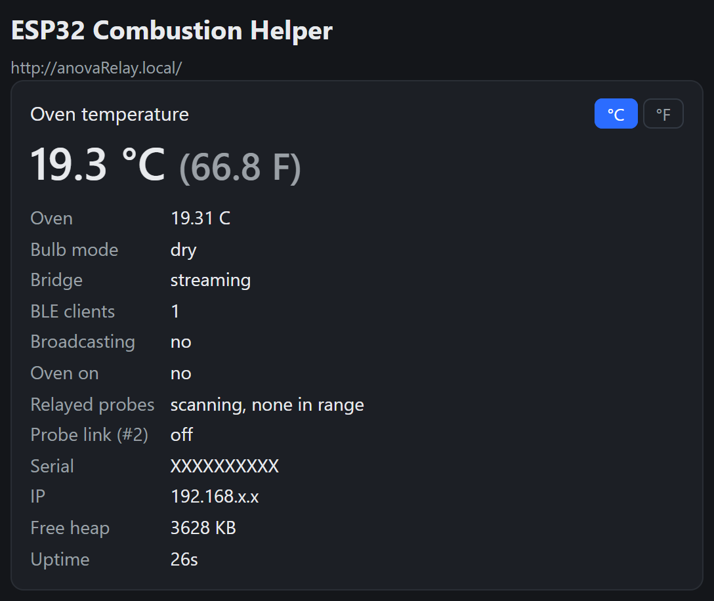
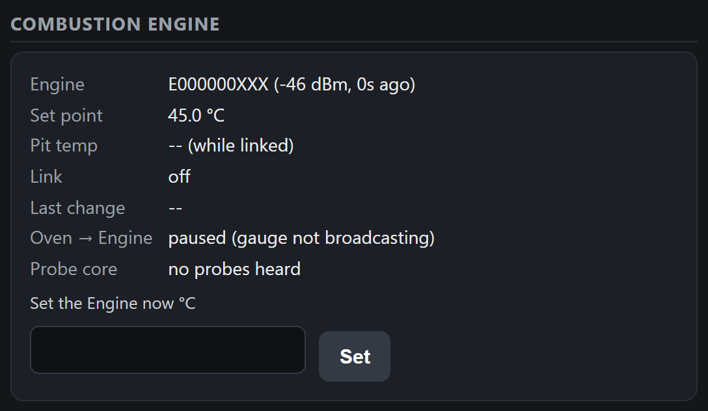
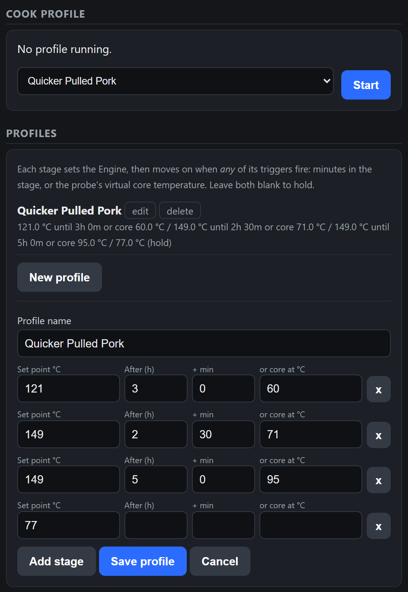

# ESP32 Combustion Helper

An ESP32 (MicroPython) companion for the Combustion Inc. ecosystem.



- **Exposes your Anova oven as a Gauge in the Combustion app.** The oven's
  live temperature (wet bulb in sous-vide mode, dry bulb otherwise, from the
  official Anova API) appears as a Gauge. You can even pick it as a
  Combustion **Engine**'s control device, so the Engine can try and fail to
  regulate the oven's temperature.
- **Lets you build Engine profiles, not just one temperature.** Multi-stage
  cooks where the Engine's set point changes after a set time and/or when
  the probe's virtual core temperature is reached (e.g. the built-in
  *Quicker Pulled Pork*).
- **Also works as a MeatNet repeater.** Relays nearby probes'
  advertisements to extend range, with an optional probe connect proxy.

All of it is managed from a web UI at `http://anovarelay.local/` with live
status, logs and °C/°F.

The gauge serial is derived from the chip MAC.

<br clear="right">


## Setup instructions

### 1. What you need

- An **ESP32-S3** or an **ESP32 with PSRAM** (e.g. LOLIN D32 Pro). The Anova
  WiFi + TLS bridge needs the hardware crypto of the S3 or the extra RAM of a
  PSRAM board.
- An **Anova Precision Oven** on your Anova account, and an Anova **Personal
  Access Token**.
- A host PC with **Python 3** and a USB cable.

### 2. Install the host tools

```
python -m pip install esptool mpremote pyserial
```

Find the board's serial port: `python -m serial.tools.list_ports`.

### 3. Flash MicroPython

Download the firmware for your board from
[micropython.org/download](https://micropython.org/download/) (v1.28.0+):

| Board | Firmware variant | Flash offset |
|---|---|---|
| ESP32-S3 | `ESP32_GENERIC_S3` | `0x0` |
| ESP32 + PSRAM (WROVER / D32 Pro) | `ESP32_GENERIC-SPIRAM` | `0x1000` |
| plain ESP32 (BLE gauge only) | `ESP32_GENERIC` | `0x1000` |

```
python -m esptool --port <PORT> erase_flash
python -m esptool --port <PORT> --baud 460800 write_flash <OFFSET> <firmware.bin>
```


### 4. Get your Anova token

Sign in at [developer.anovaculinary.com](https://developer.anovaculinary.com)
and create a **Personal Access Token** (the `anova-...` string).

### 5. Configure

Optional: you can do this after upload in the web ui.

Copy `sample_config.json` to `config.json` and edit it (2.4 GHz WiFi + your
PAT; the rest are sensible defaults). `config.json` is git-ignored because it
holds your WiFi password and Anova token.

```json
{
  "wifi_ssid": "your-2.4GHz-ssid",
  "wifi_password": "...",
  "anova_pat": "anova-...",
  "mdns_hostname": "anovaRelay",
  "follow_oven": true,
  "broadcast_mode": "always",
  "broadcast_grace_min": 10,
  "relay_probes": "oven",
  "relay_connect": false,
  "engine_enabled": true,
  "engine_serial": "",
  "profile_probe": ""
}
```

`engine_serial` / `profile_probe` are optional pins (leave blank to use the
nearest Engine and whichever probe is reporting a core temperature).

### 6. Deploy the code

From the repo directory, copy **all** the modules plus your config to the board:

```
python -m mpremote connect <PORT> fs cp protocol.py gauge.py central.py ble.py engine.py profiles.py anova.py web.py main.py config.json :
```

### 7. First run

Reset the board (or `python -m mpremote connect <PORT> reset`). `main.py`
auto-starts on boot: it connects to WiFi, starts the Anova bridge, and serves
the web UI. After ~15 s open **http://anovarelay.local/** (or the IP printed
on the serial console: `[web] config UI at ...`).

- Watch/interact over serial: `python -m mpremote connect <PORT> repl`, then
  type a temperature (`110`, `225f`) or `help`.
- Re-deploying a single file after an edit:
  `python -m mpremote connect <PORT> fs cp web.py :` (the board reboots).

## Files

| File | Purpose |
|---|---|
| `protocol.py` | Wire formats |
| `gauge.py` | Device state machine: logs, alarms, request handling |
| `ble.py` | BLE transport: advertising set + NUS GATT server, MeatNet relay, passive scan of Engines/probes (low-level `bluetooth` API) |
| `central.py` | Reusable BLE central link (connect → discover → notify → write), used for the probe proxy and the Engine |
| `engine.py` | Combustion Engine control: set point changes with confirm/retry, probe virtual-core readings |
| `profiles.py` | Cook profiles (`profiles.json`) and the stage runner (`run.json`, resumes after reboot) |
| `anova.py` | Anova cloud client (WebSocket over TLS), runs in its own thread |
| `web.py` | Web UI: HTTP + WebSocket server (status/log stream, config, control) |
| `main.py` | Auto-starting console, 1 Hz tick/notify loop and 10 Hz BLE link loop; wires everything together |
| `config.json` | WiFi, Anova PAT, and feature settings (deployed to the board) |
| `docs/screenshots/` | Web UI screenshots used in this README |


## Web UI (config + control)

When WiFi is up, the device serves a config/control panel on port 80 —
open `http://anovarelay.local/` from any browser or phone on the same network
(the IP is printed on the serial console at boot: `[web] config UI at ...`).

- **Live status + log** over a WebSocket, with a °C/°F toggle.
- **Combustion Engine**: the Engine's set point, pit temperature, App Mode,
  whether the oven is feeding it, and nearby probes' core temperatures;
  set the Engine directly.
- **Cook profile / Profiles**: start, skip and stop runs; create and edit
  profiles.
- **Control** follow-oven toggle, manual temperature,
  sensor-present / low-battery / overheating flags, high/low alarms,
  **broadcast mode** and the **MeatNet relay** mode.
- **Configuration** (saved to `config.json`; reboot to apply): WiFi
  credentials, gauge serial, Anova Personal Access Token, mDNS hostname,
  follow-on-boot. "Save & reboot" persists and restarts the device.


### Using the oven as the Engine's control device

In the Combustion app you can pick the Helper's virtual gauge as the Engine's
control device, so the Engine can try and fail to regulate the **oven's**
temperature. A real
Gauge does this by connecting *out* to the Engine and pushing its Gauge
Status (0x60) over MeatNet UART; the Engine never connects to the gauge.
The Helper does the same:

- It's automatic: the Helper checks the Engine's control device, and while
  it's this gauge, holds a link to the Engine and sends the gauge status
  every second. Choose another control device in the app to stop it. The
  web UI's "Oven → Engine" line shows what it's doing.
- It only streams while the gauge is broadcasting. In "only while oven is
  on" broadcast mode, the Engine shows its control device as disconnected
  once the oven is off and the grace period ends.

⚠️ The Engine drives its fan toward the set point using this temperature.
If the oven is cold and the set point is high, the fan runs flat out.



### Combustion Engine cook profiles

The Helper can drive a **Combustion Engine**'s set point through a multi-stage
cook profile. Each stage sets the Engine, then moves on when **any** of its
triggers fires:

- **After (h + min)**: time since the Engine took that stage's set point
- **Core at**: the probe's *virtual core* temperature reaches a value

A stage with no triggers holds indefinitely (use one as the final stage). If
the last stage has a trigger, the run ends when it fires and the Engine keeps
that set point.

The built-in **Quicker Pulled Pork** profile (hot-and-fast pork shoulder,
roughly 6–8 h instead of 12+ at 107 °C / 225 °F):

| Stage | Pit | Moves on when | Why |
|---|---|---|---|
| 1 | 121 °C / 250 °F | core 60 °C / 140 °F (or 3 h) | Smoke is absorbed (and the smoke ring forms) only while the meat is below ~60 °C, so this part stays low |
| 2 | 149 °C / 300 °F | core 71 °C / 160 °F (or 2.5 h) | Sets the bark quickly |
| 3 | 149 °C / 300 °F | core 95 °C / 203 °F (or 5 h) | **Wrap in butcher paper when this stage starts** (keeps the bark crisper than foil), then push through the stall to probe-tender |
| 4 | 77 °C / 170 °F | holds | Rest/hold; a long rest makes it pull better |

The time limits are only backstops in case the probe drops out.

Create, edit, start, skip and stop profiles in the web UI's **Cook profile /
Profiles** sections (°C/°F follows the page toggle):



How it works:

- **The Engine must be in App Mode.** It only accepts set point changes from
  an app in that mode. The UI flags it if it isn't.
- The Engine's set point and the probe's core temperature are read
  **passively from BLE advertisements** (the probe's own, or repeated by the
  Engine/other nodes). Unless the oven is the Engine's control device (see
  above), the Helper only connects to the Engine while it's changing the set
  point, then disconnects after ~15 s, so it doesn't hold one of the
  Engine's connection slots or the probe's.
- Changes are sent the way the official app does it: send, re-send every 5 s,
  and confirm by watching the Engine report the new set point. If it fails
  (Engine off, out of range, not in App Mode), the runner retries every 60 s.
- **It doesn't fight you.** If the set point is changed elsewhere (Combustion
  app, Engine knob), the runner leaves it alone until the next stage starts.
- The clock is synced by NTP after WiFi connects, and the active run is saved
  to `run.json`, so a reboot or power blip resumes at the same stage and time.
  A profile can't start until the clock has synced.
- Profiles are stored on the board in `profiles.json`, which is created with
  the Quicker Pulled Pork profile on first boot.

### Broadcast mode

- **Always** (default): the gauge always advertises over BLE.
- **Only while oven is on**: the gauge broadcasts only when the oven is
  actively cooking (`state.state.mode != "idle"`), and for a configurable
  **grace period** (minutes) after it turns off, then stops advertising and
  disconnects any client. It resumes automatically when the oven turns on
  again. Useful to keep the device silent/idle between cooks.


### MeatNet probe relay

Set in the web UI Control section (persisted as `relay_probes`): **Off**,
**On**, or **Only while oven is on** (default). When active, the device scans for nearby Combustion **probes** advertising
directly (product type 1) and re-broadcasts each one as a repeated MeatNet
**node** advertisement (product type 2) with the hop-count byte set, so the
probe's live temperature reaches the app *through* the Helper when the probe
is out of the phone's range. 